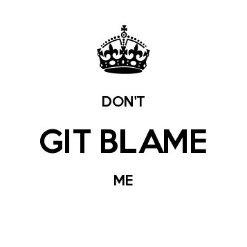
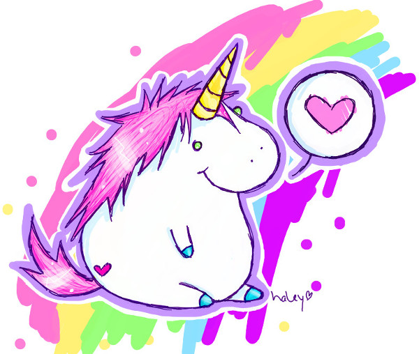
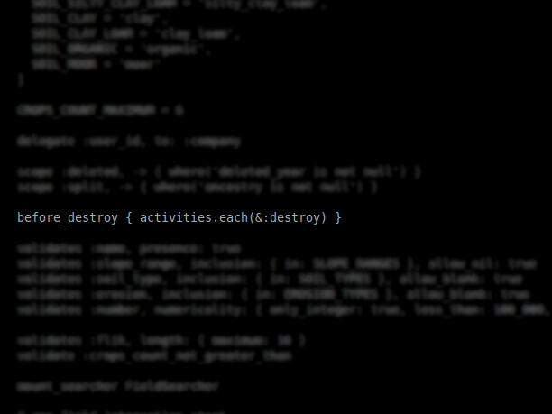
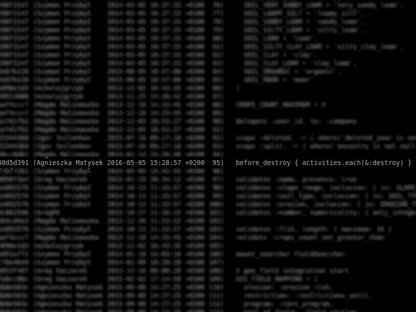
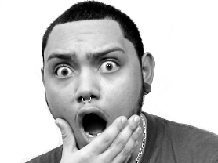
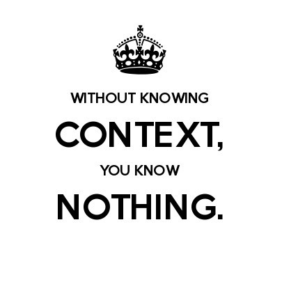

class: center, middle

.middle-image[]

---

class: center, middle

# Building application

.middle-image[]

???

- we are happy
- we are coding your beautiful application

---

class: middle, center

# Bug

.middle-image[]

???

- something is wrong
- something is broken

---

class: middle, center

# Searching...
.middle-image[]

???

- we are finding line

---

class: middle, center

.large-image[]

---

class: middle, center

# git blame

???

- who did that? who broke this code?

---

class: middle

```console
git blame my_app/app/models/...
```

---

class: center, middle

.large-image[]

---

class: middle, center

# What?

.middle-image[]

???

- What? Me? This is impossible!
- I don't do that kind of code!
- I don't write broken code

---

class: middle, center

# Just wait!

.middle-image[]

???

- I don't remember that code
- I didn't write this

---

class: middle

```bash
40d5d391 - [#127893095] Rubocop - style auto-formatting
```

???

- go through commits
- true, I didn't break this code
- auto formatting form rubocop

---

class: middle, center

# Looking for more informations...

.middle-image[]

???

- Who did this?

---

class: middle, center

# And what?

.middle-image[]

???

- What's happened?
- Nothing, I found name but this person didn't work in project at least one year
- I never met this person, never talked with this person

---

class: center, middle

# This are only tools...

.middle-image[]

???

- we can use tools not only for good things
- we can use tools in different way, then they was created
- tools don't show all true
- tools can be wrong
- tools are only tools
- we do interpretation

---

class: center, middle

# Responsibility

.middle-image[]

???

- Everyone is responsible for code
- Even it was only generator
- Where was this mistake?
- On PR step, development step or testing step?
- every one is partially responsible for this failure

---

class: center, middle

# All picture

.middle-image[]

???

- tools don't have all picture
- don't understand situation
- they don't tell us why this change is here
- what was the main problem, why programmer decide to this change
- how this code looks before
- which decision make programmer and why
- we don't know context

---

class: middle, center

.middle-image[]

???

- Think, before doing.
- Without knowing context, you know nothing.

---

class: middle

# Bibliography

- http://albumarium.com/
- http://www.keepcalmandcarryon.com/creator/
- http://en.freejpg.com.ar/
- https://upload.wikimedia.org/wikipedia/commons/0/0f/Kevin_Marc_Face.jpg

---

class: middle, center, contact

.small-image[]
### Agnieszka Matysek
[@womanonrails](https://twitter.com/womanonrails)

amatysek&#064;fractalsoft&#046;org

